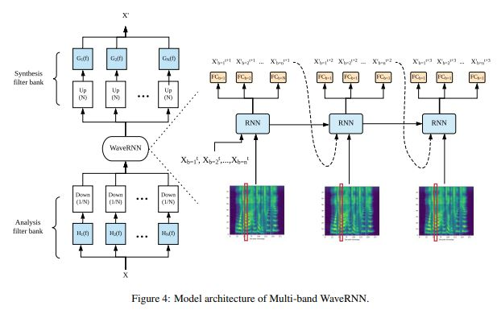

# subband_WaveRNN
A pytorch implementation of the subband_WaveRNN mentioned in DURIAN(https://arxiv.org/pdf/1909.01700.pdf)

## Attention
* I did not add local condition, I just implemented the subband framework. 
* If you want to use it, you should add local condition for it, and you should aslo implement a sub-band filter.

## Reference
* DURIAN: DURATION INFORMED ATTENTION NETWORK FOR MULTIMODAL SYNTHESIS(https://arxiv.org/pdf/1909.01700.pdf)
* [fatchord/WaveRNN](https://github.com/fatchord/WaveRNN).
